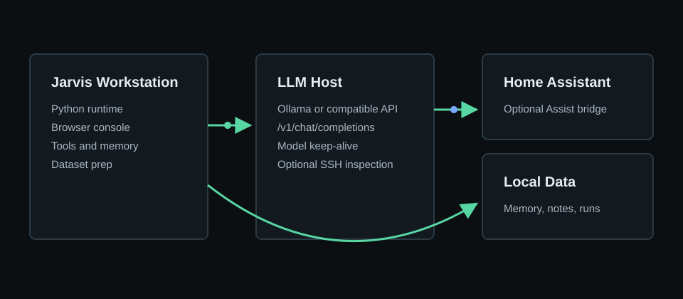

# Jarvis Local LLM Assistant

Jarvis is a self-hosted assistant package for a local workstation plus an optional LAN LLM server. It includes:

- a deterministic offline backend for install verification
- an OpenAI-compatible local LLM backend, tested with Ollama
- a browser console for chat, model discovery, and LLM host inspection
- a VM-side Jarvis LLM UI/API service for Ollama, dashboard status, Home Assistant webhooks, prompt review, and benchmark checks
- local memory and notes
- helper tools for project status, host checks, model checks, and Home Assistant voice experiments
- voice dataset preparation utilities for custom TTS work

Use only voices, recordings, and automation targets that you own or have permission to use.



## Quick Start

Windows PowerShell:

```powershell
git clone https://github.com/gmode2020x-tim/jarvis-local-llm.git
cd jarvis-local-llm
Copy-Item .env.example .env
.\scripts\install_prereqs.ps1

$env:JARVIS_BACKEND = "local"
.\.venv\Scripts\python.exe .\scripts\verify_assistant.py
```

Expected final line:

```text
jarvis verification passed
```

Run the local browser console:

```powershell
.\.venv\Scripts\python.exe .\scripts\run_app.py
```

Open `http://127.0.0.1:8765`.

## Add A Local LLM

On a Linux machine or VM that will host Ollama and the Jarvis VM UI:

```bash
sudo JARVIS_MODEL=llama3.2:3b bash scripts/setup_jarvis_vm.sh
```

Then set `.env` on the workstation:

```dotenv
JARVIS_BACKEND=llm_vm
JARVIS_LLM_VM_HOST=YOUR-LLM-HOST
JARVIS_LLM_VM_BASE_URL=http://YOUR-LLM-HOST:11434/v1
JARVIS_MODEL=llama3.2:3b
```

Verify model discovery:

```powershell
.\.venv\Scripts\python.exe .\scripts\inspect_llm_vm.py
```

Start chat:

```powershell
.\.venv\Scripts\python.exe .\scripts\run_assistant.py
```

Open the VM dashboard:

```text
http://YOUR-LLM-HOST:8787
```

## Documentation

- [Quickstart](docs/QUICKSTART.md)
- [Configuration](docs/CONFIGURATION.md)
- [LLM server setup](docs/LLM_SERVER_SETUP.md)
- [VM UI/API package](vm/llm-ui/README.md)
- [Tuning guide](docs/TUNING.md)
- [Home Assistant integration](docs/HOME_ASSISTANT.md)
- [Wake word setup](docs/JARVIS_WAKE_WORD.md)
- [Voice dataset prep](docs/VOICE_DATASETS.md)
- [Public release checklist](docs/SECURITY_PUBLIC_RELEASE.md)

## Project Map

- `assistant/` - runtime, configuration, tools, memory, speech, and LLM host inspection.
- `scripts/run_assistant.py` - interactive terminal chat or local voice verification.
- `scripts/run_app.py` - browser console at `127.0.0.1:8765`.
- `scripts/verify_assistant.py` - deterministic install verification.
- `scripts/inspect_llm_vm.py` - ping, port, HTTP model, and optional SSH inspection.
- `scripts/prepare_dataset.py` - converts source audio to clean LJSpeech-style clips.
- `scripts/check_dataset.py` - validates generated voice datasets.
- `scripts/setup_jarvis_vm.sh` - installs Node, Ollama, models, and the VM-side Jarvis UI service.
- `scripts/setup_ollama_linux.sh` - installs and exposes Ollama on a Linux LLM host.
- `vm/llm-ui/` - deployable VM-side dashboard, API, Home Assistant webhook, Docker Compose, and systemd unit.

## Public Safety

Do not commit `.env`, SSH keys, model weights, voice recordings, generated datasets, runtime memory, or private Home Assistant tokens. They are ignored by default.

Before publishing:

```powershell
powershell -ExecutionPolicy Bypass -File .\scripts\check_public_release.ps1
git status --short
```

Publish with GitHub CLI after authentication:

```powershell
powershell -ExecutionPolicy Bypass -File .\scripts\publish_github.ps1 -RepoName jarvis-local-llm -Visibility public
```
