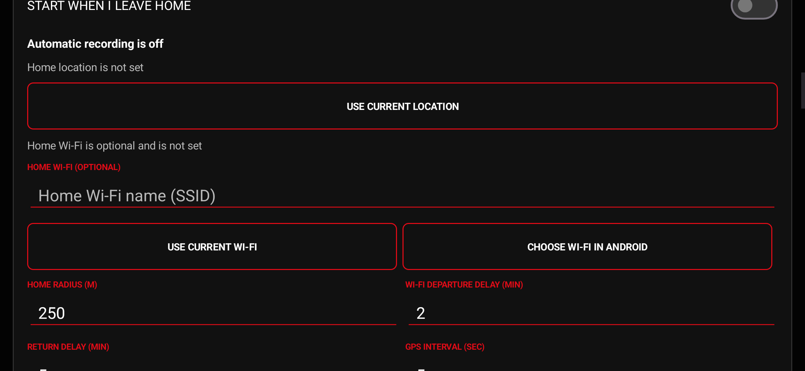
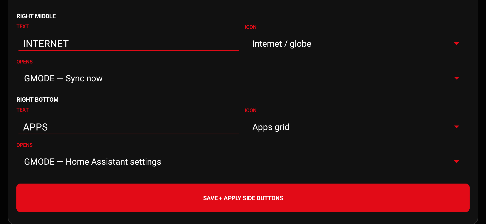

# GMODE Trip Recorder 2.0

GMODE Trip Recorder is an offline-first Android GPS and telemetry recorder designed for a landscape-mounted phone. It records to a local Room database first, keeps working without Home Assistant, exports standard trip files, and retries authenticated Home Assistant uploads when connectivity returns.

The v2 cockpit combines a scene-matched procedural 3D vehicle, live pitch and roll, GPS or magnetic course, warning limits, configurable gauges, six app-launch buttons, and live phone/network indicators. The 1280 x 592 design scales uniformly on different displays so the gauge stays circular and the dashboard geometry remains unchanged.


## Download version 2.0.0

- **Recommended phone package:** [GMODE-Trip-Recorder-v2.0.0-install.zip](https://github.com/gmode2020x-tim/jarvis-local-llm/releases/download/v2.0.0/GMODE-Trip-Recorder-v2.0.0-install.zip)
- **APK only:** [GMODE-Trip-Recorder-v2.0.0-sideload.apk](https://github.com/gmode2020x-tim/jarvis-local-llm/releases/download/v2.0.0/GMODE-Trip-Recorder-v2.0.0-sideload.apk)
- **Checksums:** [GMODE-Trip-Recorder-v2.0.0-SHA256SUMS.txt](https://github.com/gmode2020x-tim/jarvis-local-llm/releases/download/v2.0.0/GMODE-Trip-Recorder-v2.0.0-SHA256SUMS.txt)
- **Release page:** [GMODE Trip Recorder v2.0.0](https://github.com/gmode2020x-tim/jarvis-local-llm/releases/tag/v2.0.0)

The ZIP contains the sideload APK, checksum file, this installation guide, and the screenshots used below. The Play `.aab` on the release page is for Google Play Console and cannot be installed directly on a phone.

## Highlights

- Manual or opt-in automatic trip recording with Street, Off road, Snow, and Water classifications.
- Hybrid home detection using the saved GPS zone and optional current Wi-Fi SSID.
- Local recording of GPS, accuracy, altitude, vertical accuracy, speed, bearing, GNSS satellites, barometer, motion summaries, battery, charging state, and network type.
- Five scene-matched 3D vehicles: Truck, SxS, Sand rail, Snowmobile, and Mini jet boat.
- Thirteen selectable gauges with logical, sensor-specific scales and unlimited arrow navigation.
- Six editable side buttons that can run GMODE actions or launch installed Android apps.
- Reference Red plus five preset themes and a custom RGB accent.
- Stationary pitch/roll zero calibration and adjustable caution/limit thresholds.
- GPX, KML, GeoJSON, and full-telemetry CSV export through Android's document picker.
- Durable Home Assistant uploads in idempotent 500-point batches with network-constrained retry.
- No advertising, analytics, account system, or GMODE cloud service.

## Documentation

- [User guide](docs/USER_GUIDE.md)
- [Complete settings reference](docs/SETTINGS_REFERENCE.md)
- [Gauges and sensors](docs/GAUGES_AND_SENSORS.md)
- [Home Assistant setup](docs/HOME_ASSISTANT_SETUP.md)
- [Architecture and data flow](docs/ARCHITECTURE.md)
- [Privacy policy](PRIVACY_POLICY.md)
- [Google Play listing copy](docs/PLAY_STORE_LISTING.md)
- [Google Play submission checklist](docs/PLAY_STORE_SUBMISSION.md)
- [Dashboard geometry reference](DASHBOARD_REFERENCE.md)
- [Changelog](CHANGELOG.md)
- [Security policy](SECURITY.md)

## Install on a Samsung Galaxy S24

The GitHub release has two deliberately different artifacts:

- `GMODE-Trip-Recorder-v2.0.0-sideload.apk` is signed with the existing sideload/debug lineage so it can update the previous GitHub APK without erasing local trips or settings.
- `GMODE-Trip-Recorder-v2.0.0-play.aab` is signed with the private upload key and is intended only for Google Play Console. Google Play App Signing supplies the distribution signature. Do not try to open the AAB on the phone.

### 1. Download and extract

1. Open the **recommended phone package** link above in Chrome or Samsung Internet.
2. If GitHub shows the release page, expand **Assets** and tap `GMODE-Trip-Recorder-v2.0.0-install.zip`.
3. When the download finishes, open Samsung **My Files > Downloads**.
4. Tap the ZIP, choose **Extract**, then open the extracted folder.
5. Tap `GMODE-Trip-Recorder-v2.0.0-sideload.apk`.

You can skip extraction by downloading the **APK only** link instead.

### 2. Allow this installer

Android blocks sideloaded apps until the app that opened the APK is approved.

1. If **For your security, your phone currently isn't allowed to install unknown apps from this source** appears, tap **Settings**.
2. Enable **Allow from this source** for the app shown, normally **My Files**, Chrome, or Samsung Internet.
3. Return to the installer. Disable this permission again after installation if you do not normally sideload apps.

The same control is available under **Settings > Security and privacy > More security settings > Install unknown apps**. Samsung may move or rename it slightly in later One UI versions.

### 3. Install or update

1. Confirm the app name is **GMODE Trip Recorder** and tap **Install**.
2. If an older GMODE release is present, Android should offer **Update**. Choose it to retain local trips and settings.
3. Do **not** uninstall the old version first unless you intentionally want to erase app-private trips and settings.
4. When Android reports **App installed**, tap **Open**.

If Android reports that the package conflicts with an existing app, the installed copy was signed by a different key. Export any required trips, uninstall that incompatible copy, and then install v2.0.0.

### 4. Complete first-run permissions

1. Keep the S24 in landscape with the back of the phone facing forward in the vehicle.
2. Press **Start**, read the prominent location disclosure, and continue.
3. Turn on **Use precise location** and choose **While using the app** when Android asks for location access.
4. Allow notifications when asked. Android requires the recording foreground service to display an ongoing notification.
5. If automatic departure recording will be used, open Android's GMODE permission page and change **Location** to **Allow all the time**. Manual recording does not require background location.

Successful installation opens this cockpit:


### 5. Prevent Samsung from suspending recordings

1. In GMODE, open the gear icon and select **System > S24 battery settings**.
2. In Android, select **Battery > Unrestricted** for GMODE Trip Recorder.
3. Open **Settings > Battery > Background usage limits** and remove GMODE from **Sleeping apps** and **Deep sleeping apps**.
4. Add it to **Never auto sleeping apps** when that option is available.
5. Do not use Android **Force stop** after arming automatic recording; a force-stopped app cannot receive departure events until it is opened again.

### 6. Configure automatic home detection (optional)

1. At home, open GMODE settings and press **Use current location**.
2. Optionally press **Use current Wi-Fi** to add the connected home SSID as a second signal.
3. Enable **Start when I leave home**, select the trip type, and review the radius and delays.
4. Press **Save automatic settings** and confirm GMODE reports that departures are armed.



### 7. Verify the installation

1. Return to the cockpit and press **Trip** to select Street, Off road, Snow, or Water.
2. Press **Start** and confirm the lower-left timer changes to a live recording state.
3. Move outdoors with a clear sky view and confirm GPS/satellite, speed, course, and telemetry begin updating.
4. Press **Stop** and export the short test trip as GPX or CSV.
5. If Home Assistant is configured, press **Sync now** and confirm the status changes to **Up to date**.

The six side buttons can be assigned after installation:



### 8. Verify the downloaded file (optional)

The published SHA-256 file lets you confirm that the download is complete and unchanged. On Windows PowerShell:

```powershell
Get-FileHash .\GMODE-Trip-Recorder-v2.0.0-sideload.apk -Algorithm SHA256
```

The APK must equal:

```text
158a742cb609282daff82be7a367f631743672655d22ce8918e647e3432a9dab
```

### Installation troubleshooting

- **Download reaches 100% but never opens:** cancel the browser's preview, open **My Files > Downloads**, and open the completed ZIP or APK there.
- **Can't open file:** make sure the filename ends in `.apk`, not `.aab`; extract it first if it is inside the ZIP.
- **Install button is blocked:** turn off screen-overlay apps temporarily and retry from My Files.
- **App not installed:** delete the incomplete download, download the ZIP again, and compare the checksum.
- **Automatic recording does not start:** grant **Allow all the time** location access, use **Unrestricted** battery mode, remove GMODE from Samsung sleeping lists, open GMODE once after any force stop or reboot, and save automatic settings again.
- **No live GPS data indoors:** test outside with precise location enabled and a clear view of the sky.

## First run checklist

1. Press **Start** and review the prominent location disclosure, then allow precise location. Notifications are requested separately when recording begins.
2. In **Settings > System > S24 battery settings**, make the app unrestricted and remove it from Samsung sleeping/deep-sleeping app lists.
3. Record manually, or configure the automatic home zone as described in the [user guide](docs/USER_GUIDE.md).
4. To sync, install the companion Home Assistant integration and enter the server URL plus a Home Assistant long-lived access token.
5. Use **Privacy + data use** at any time to review the in-app summary and open the full policy.

## Build requirements

- JDK 17
- Android SDK Platform 36 and Build Tools 36.0.0
- Android Gradle Plugin 8.13.2 and Gradle 8.13 (declared by the project)
- `local.properties` with `sdk.dir=...`, or Android Studio with the SDK configured

Debug verification:

```powershell
.\gradlew.bat testDebugUnitTest lintDebug connectedDebugAndroidTest assembleDebug
```

Create the upgrade-compatible sideload APK:

```powershell
.\gradlew.bat assembleSideload
```

Create the Play upload bundle after copying `keystore.properties.example` to the ignored `keystore.properties` and supplying an upload keystore:

```powershell
.\gradlew.bat bundleRelease
```

Never commit `keystore.properties`, a `.jks` file, a Home Assistant token, or generated private trip data.

## Home Assistant upload contract

`UploadWorker` sends `POST /api/gmode_trip_recorder/mobile/upload` with the user's bearer token. Each request contains one trip and up to 500 points. The integration returns acknowledged point IDs; the phone marks only those IDs synchronized. Stable IDs make retries safe. Local rows are retained after upload so the phone remains a complete export source.

## Supported Android versions

The app supports Android 10 (API 29) and newer, targets Android 16/API 36 for Google Play, and is optimized for landscape phone use. The primary hardware target is Samsung Galaxy S24.
