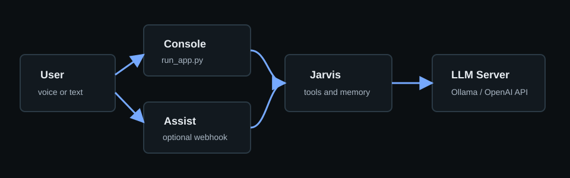

# Home Assistant Integration

Jarvis can be used beside Home Assistant in two ways:

- Home Assistant calls a Jarvis-compatible webhook or LLM service for Assist responses.
- Jarvis scripts inspect or push Home Assistant-adjacent data, such as wake-word models or camera/event summaries.

This repo does not include Home Assistant credentials. Keep tokens in Home Assistant secrets, `.env`, or your service manager.

## Wake Word

See [JARVIS_WAKE_WORD.md](JARVIS_WAKE_WORD.md).

## Assist Pipeline Pattern

Recommended shape:

1. Home Assistant handles wake word and speech-to-text.
2. A webhook sends recognized text to your LLM host.
3. The LLM host calls Jarvis or another local model route.
4. Home Assistant handles text-to-speech.

## Example REST Command

See `examples/home-assistant-rest-command.yaml`.

Never commit Home Assistant long-lived access tokens.
